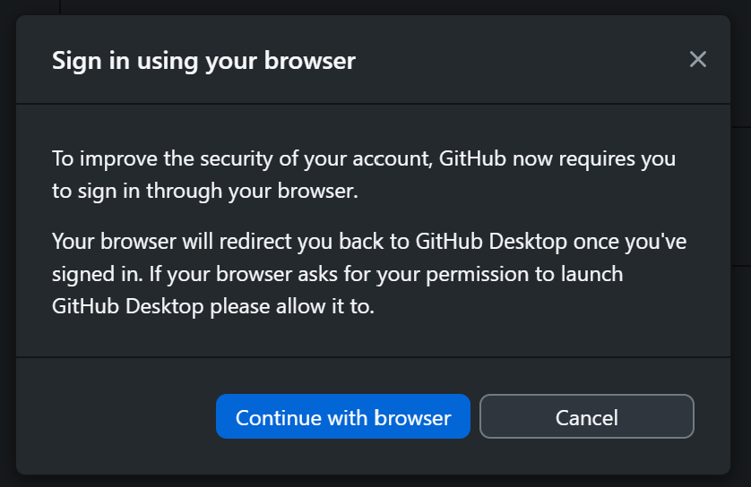
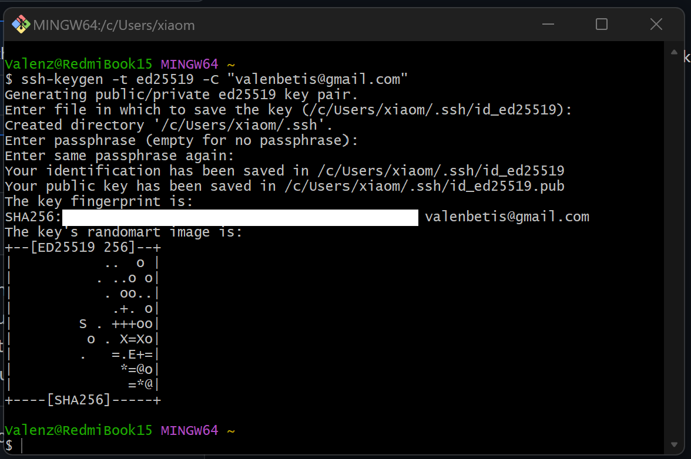
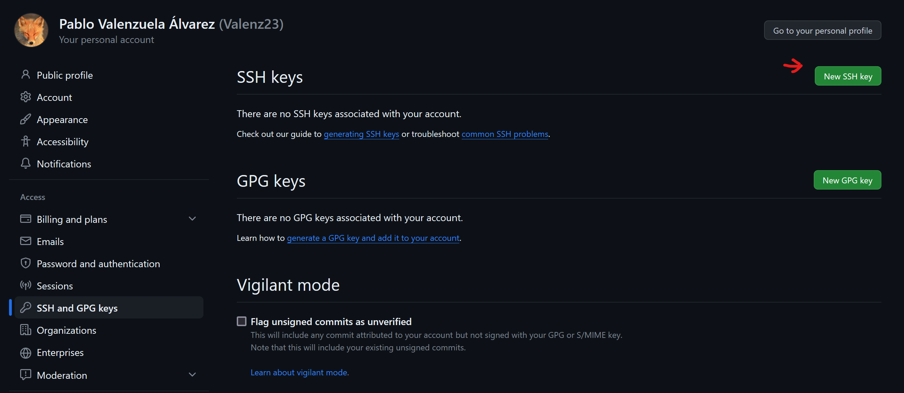
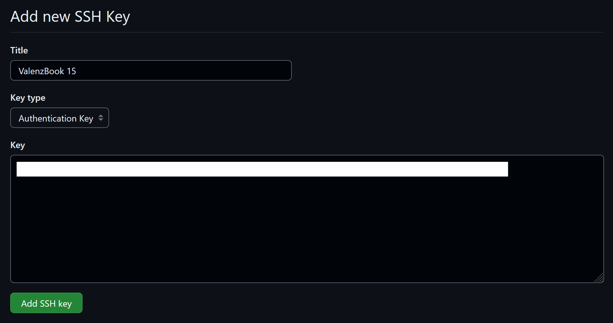
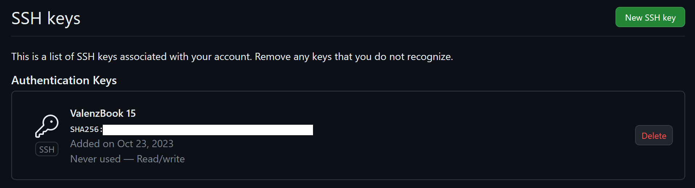

# Entorno de trabajo

## Sistema Operativo

En este proyecto usare Windows, en concreto la version 11 Pro. He elegido este	sistema por comodidad y porque es el que llevo usando años para trabajar (+info).
		
## Editor de codigo

Como editor usare VSCode porque es el editor con el que trabajo y me siento mas	comodo (+info).
		
## Configuracion de GitHub
	
Voy a usar el entorno grafico de github para windows.

Una vez instalado, para loguearnos en la aplicacion pulsamos en la barra superior *File -> Options* y seleccionamos el boton **'Sign in'** que esta indicado en la siguiente imagen. 

Seguidamente nos mandara a loguearnos via web y se vinculara con nuestra cuenta de github. (Se sobreentiende que ya tienes una cuenta creada previamente).

Para generar las claves ssh, usaremos git-bash. En la consola vamos a escribir:	``ssh-keygen -t ed25519 -C "valenbetis@gmail.com"`` para generar la clave. 

Nos preguntara donde queremos guardarlo y una contraseña, en mi caso lo deje en blanco para que lo guarde en el lugar por defecto 	(*miUsuario/.ssh/id_ed25519.pub*).
		
		
Ahora volvemos a la web seccion *Settings --> SSH and GPG keys*.

 

Y la añadimos.

. 

Podemos ver en la pagina siguiente como ya tenemos disponible nuestra clave public. 

Por ultimo, configuramos nuestra cuenta como nos dice la explicacion del hito 0. Poniendo un avatar, nuestro nombre completo, ciudad y universidad.

	
	