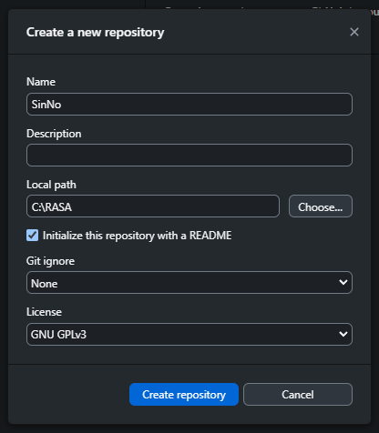
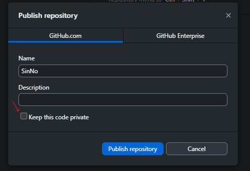
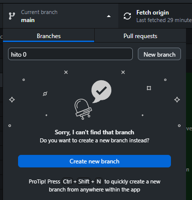
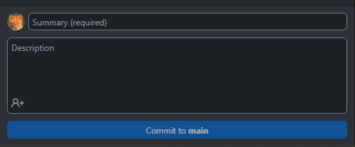
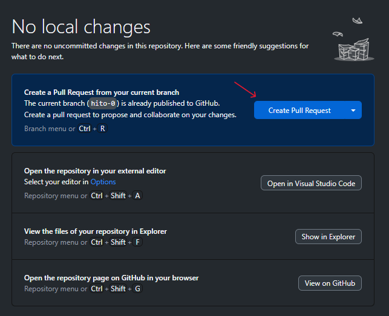
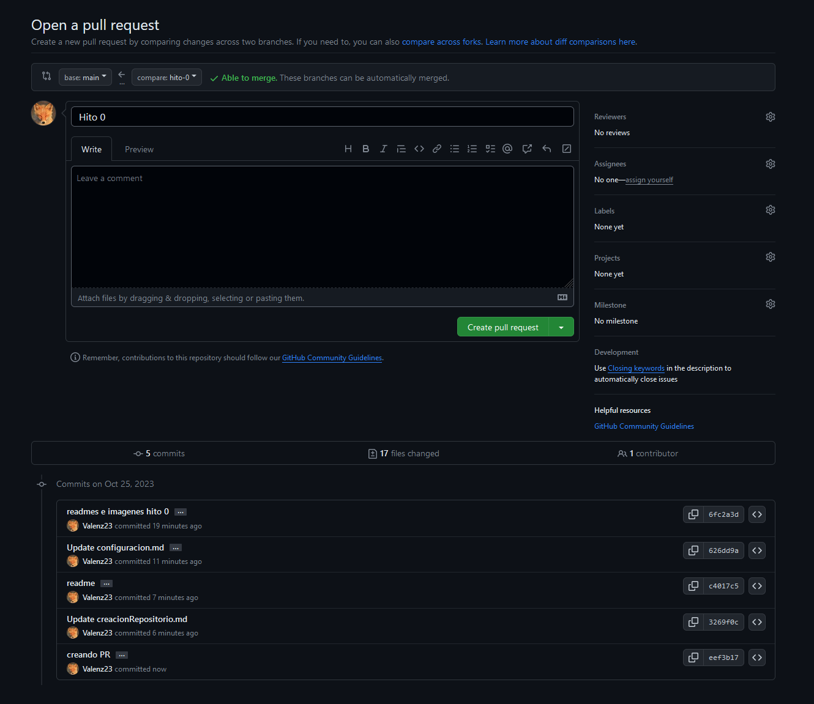

# Creación del repositorio

Para crear un repositorio desde el entorno gráfico de github hay que dirigirse a la sección ``File --> New Repository`` o pulsar ``Ctrl+N``.

En la imagen siguiente podemos ver las opciones con las que podemos crear nuestro repositorio.

- El nombre del repositorio es provisional y lo cambiare más tarde porque aun no tengo claro el tema del que va a tratar el proyecto.
- No pondré descripción y elegiré el directorio donde tengo otros proyectos en github.
- Clicamos la opción de iniciar con un archivo README.
- Y usaremos la licencia GNU GLPv3.		

Nos aseguramos que el código sea público desmarcando la opción señalada en la siguiente imagen.

# Un poco de uso

Paso a explicar el uso básico respecto a la creación de ramas y commits desde la aplicación.

## Creación de ramas

Como se puede observar en la siguiente imagen, en la sección superior si pulsamos ``Current branch`` podemos elegir las ramas que queramos usar.

En este caso, al estar recien creado el repositorio, no hay ninguna y procedo a crear la primera rama llamada ``Hito 0``.

Es muy recomendable trabajar en ramas en este tipo de aplicaciones, así no afectamos al proyecto principal en el caso de que surjan errores y no sepamos como solucionarlos.

## Commits

En la sección inferior izquierda de la aplicación, tenemos el cuadro para hacer ``commits``.

La estructura es la siguiente:
- **Sumario**: tiene que ser breve y tratar de ser un titulo para la actualización del código
- **Descripción**: aqui ya nos podemos explayar más, indicando los cambios y las nuevas funcionalidades de nuestro código.
- **Commit to main**: rama sobre la que se hará la actualización.

## Pull Request

La siguiente imagen muestra como se puede activar un **Pull Request**

Esta opción sólo se activará después de un commit en una rama que no sea la **master**. Si estuvieramos en dicha rama no haría falta hacer un **pull request**.

Pulsando en el botón indicado en la imágen anterior llegaremos a la web donde podremos ver la orden de **pull reqquest** y los commits que se han hecho sobre ella:

[Volver](README.md)

