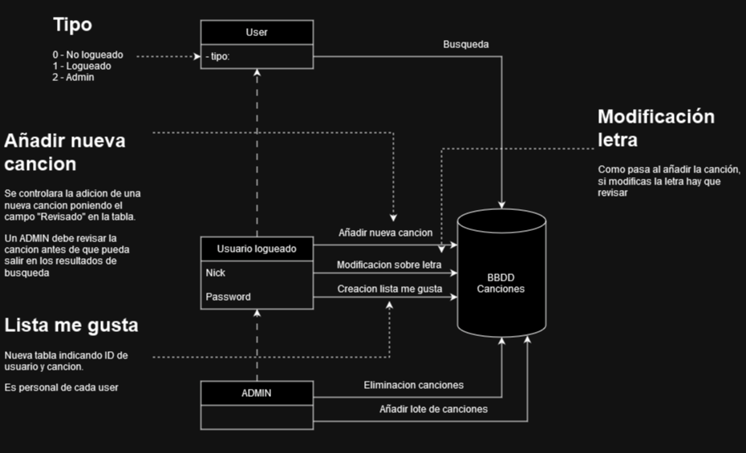
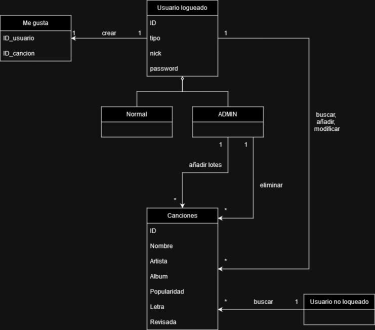

# Metodología usada para la creación de historias

Durante esta semana he ido madurando la idea comentada en el hito anterior ([enlace](../Hito0/descripcionDelProyecto.md)). 

Para ayudarme a imaginar el sistema he creado un par de imágenes:

La primera imagen mostraría el uso que cada usuario de esta aplicación debería poder hacer.

Y la segunda imagen muestra un supuesto esquema de base de datos sobre la que nuestra aplicación funcionaría.

Gracias a las relaciones entre clases que hemos visto en las imágenes anteriores, ahora podemos crear historias de usuario más fácilmente.

