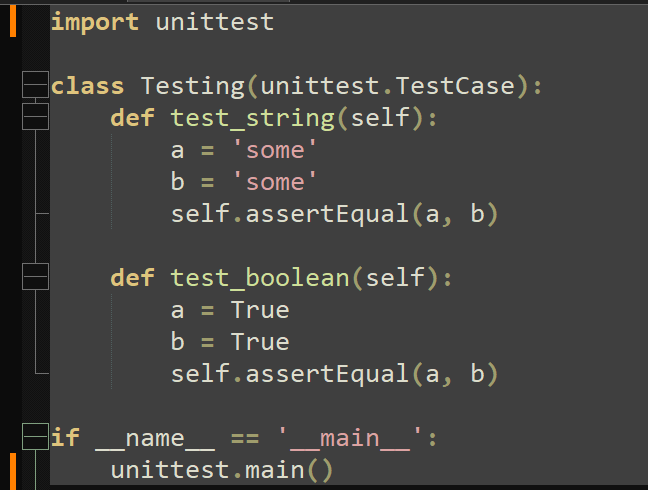
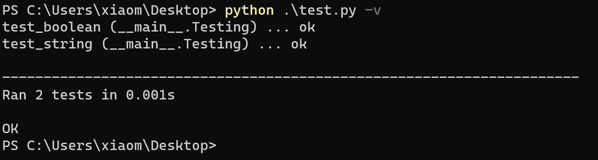

## Librería de aserciones

El siguiente paso es determinar el marco de tareas que vamos a usar. 

En este caso se usará **unittest**, porque sirve de marco de pruebas y además contiene una biblioteca de aserciones que podemos usar. Otra razón de su uso es que la librería **unittest** está integrada en la biblioteca estándar de Python, por lo que no hace falta instalar nada. 

Los ``asserts`` que proporciona pueden ser usados para verificar resultados esperados y los errores en las pruebas son fácilmente identificables, ya que muestra información detallada sobre el error.

Un ejemplo de uso de unittest es el siguiente:

El código verificará las funciones *test_string* y *test_boolean*, resultando la siguiente imagen:

Ya podemos definir tareas con **invoke** y hacer test de nuestro código con **unittest**.

[Volver](README.md)