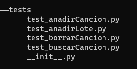

# Definición de pruebas

Las pruebas tienen que ir en relación con la lógica del negocio propuesta en hitos anteriores.

Recordando un poco, nuestro sistema permite a  los usuarios , además de buscar, añadir y modificar canciones con su letra, crear listas personalizadas. También debe facilitar la adición de canciones en lotes, desde un fichero de texto (csv, excel, etc) 

Viendo lo anterior he definido varios ficheros que simulan ejecutar las pruebas anteriores:

Los **test** hacen las siguientes funciones:
- *test_batchs.py*: testean la carga de lotes
- *test_liked_list.py*: testean las listas personalizadas
- *test_songs.py*: CRUD para canciones
- *test_users.py*: CRUD para usuarios

El gestor de pruebas se encuetra dentro del archivo ``tasks.py``, y permite realizar los test por separado, juntos e incluye un comando de ayuda.

Los **comandos** que se observan en la siguiente imagen, y pueden ser obtenidos escribiendo por consola: ``inv help`` o ``invoke help``.

Realizando todos los test juntos ejecutando el comando ``inv test -n all`` (o invoke) tenemos la siguiente salida.

Y con esto tenemos los test validados de todas las tareas que hemos definido.

[Volver](README.md)