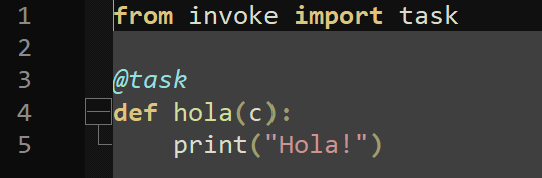
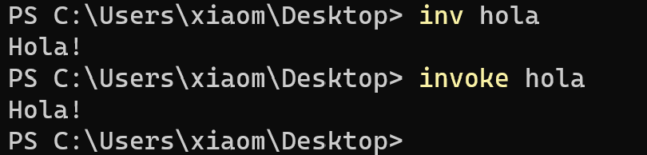

## Gestor de tareas

Para la gestión de las tareas se usaremos **Invoke**. 

**Invoke** es un paquete de Python que permite la gestión de tareas y ejecución de comandos a través de una interfaz sencilla en la que puedes definir tareas e invocarlas desde línea de comandos. 

Es usado comúnmente en procesos de desarrollo para automatizar tareas como la ejecución de pruebas, construcciñon de proyectos, genstión de entornos virtuales, etc. 

Otro ventaja que posee es la sintexis limpia y fácil de entender. 

### Instalación

Como es un paquete de Python, debemos dirigirnos a la consola y ejecutar el siguiente comando: ``pip install invoke``

Con esto ya está configurado y podemos hacer pruebas con él. Definimos un fichero llamado *task.py* con el siguiente contenido:

Con el comando ``invoke hola`` o ``inv hola`` deberiamos conseguir este resultado:

Más tarde asignaré las tareas en su respectiva sección.

[Volver](README.md)