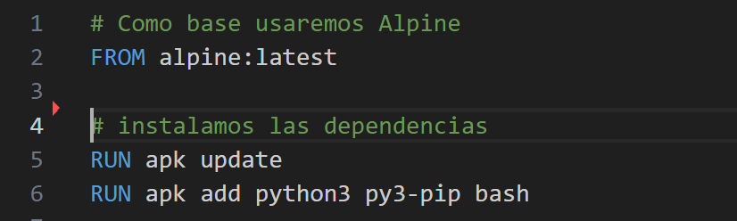
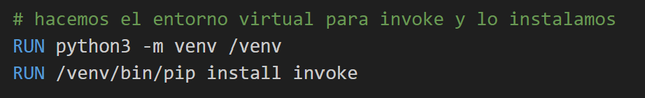
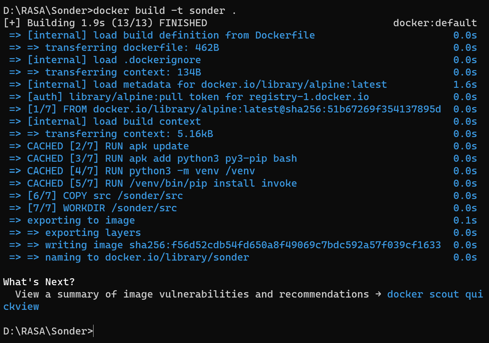

# Hito 3: Creación de un contenedor para pruebas.
 
## Elección del contenedor base

Alpine porque es una imagen de Alpine Linux que solo pesa 7.38 MB, he priorizado este contenedor al de python por esta misma razón. Solo queda añadir los paquetes que necesito para ejecutar el proyecto y los test.

## Dockerfile

EL documento [dockerfile](../../Dockerfile) está dividido en varias secciones:

1. Seleccionamos el contenedor base e instalamos sobre él los paquetes de `python`, `pip` y `bash`.

    

2. Seguido, creaamos el entorno virtual necesario para usar `invoke`.

    

3. Copiamos todo el código de nuestro proyecto y seleccionamos el fichero donde se trabajará y se ejecutarán los test.

    

4. Y por último, mandamos como orden que se ejecuten los test.

    

### Ejecutando Dockerfile

Desde consola podemos ejecutar la siguiente orden: `"docker build -t sonder ."`, para así construir la imagen de nuestro proyecto.

Como hemos usado un contenedor muy ligero, después de ejecutar el documento `Dockerfile` obtenemos un contenedor que apenas pesa unos 100 MB, como se puede observar en las siguiente figuras.

Para probar el contenedor y ver si pasa los test nos dirigimos una vez más a la consola de comandos y escribimos `docker run --name sonder sonder`.

Vemos que pasa los test, por lo que ya tendriamos un contenedor que funciona correctamente. El próximo paso será publicar nuestro contenedor en **Docker Hub** y otro servicio de contenedores como **GitHub Container Registry**.

## Publicar en Docker Hub y GitHub Packages

# completer
Se llevará a cabo en las siguientes rúbricas:

    2 puntos: contenedor subido correctamente a Docker Hub y documentación de la actualización automática.
    2 puntos: uso de registros alternativos y públicos de contenedores (como GitHub Container Registry), con la correspondiente justificación como es natural.
