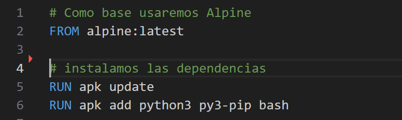
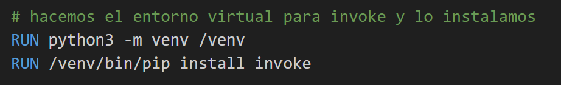
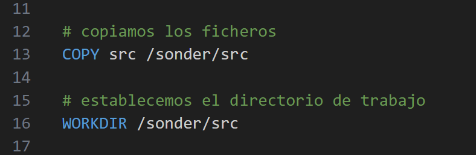
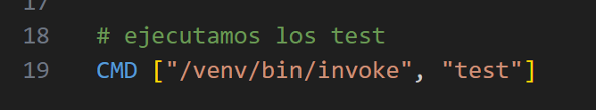
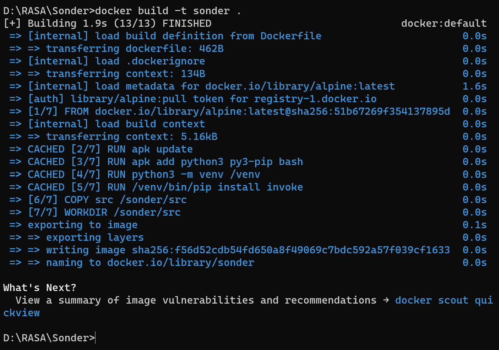
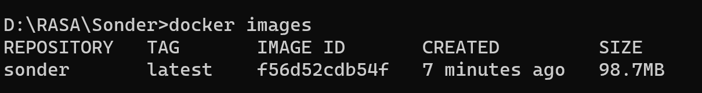
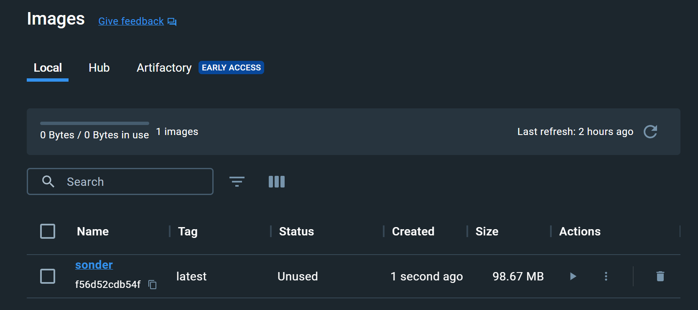
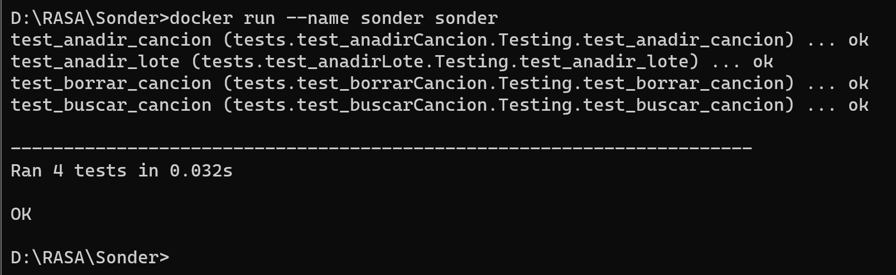

# Dockerfile

EL documento [Dockerfile](../../Dockerfile) está dividido en varias secciones:

1. Seleccionamos el contenedor base e instalamos sobre él los paquetes de `python`, `pip` y `bash`.

    

2. Creaamos el entorno virtual necesario para usar `invoke`.

    

3. Copiamos todo el código de nuestro proyecto y, seleccionamos el fichero donde se trabajará y se ejecutarán los test.

    

4. Y por último, mandamos la orden para que se ejecuten los test.

    

### Ejecutando Dockerfile

Desde consola podemos ejecutar la siguiente orden: `"docker build -t sonder ."`, para así construir la imagen de nuestro proyecto.

Como hemos usado un contenedor muy ligero, después de ejecutar el documento `Dockerfile` obtenemos una imagen que apenas pesa unos 100 MB, como se puede observar en las siguientes figuras.

Para probar el contenedor y ver si pasa los test nos dirigimos una vez más a la consola de comandos y escribimos `docker run --name sonder sonder`.

Vemos que pasa los test, por lo que ya tendriamos un contenedor que funciona correctamente. El próximo paso será publicar nuestro contenedor en **Docker Hub** y otro servicio de contenedores como **GitHub Packages**.

[Volver](README.md)