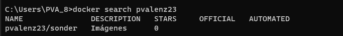
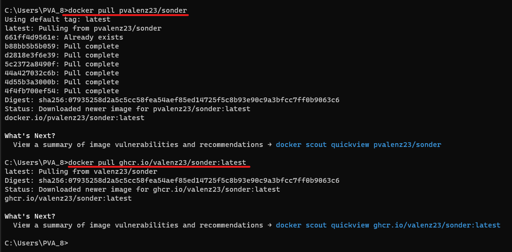
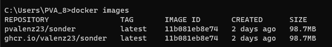
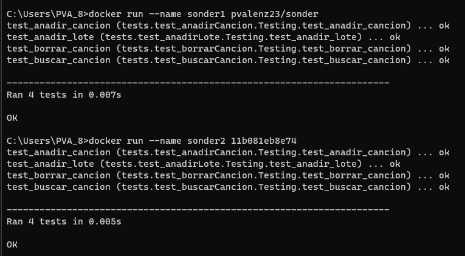
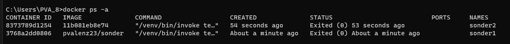

# Extra: Probando ambos repositorios

Como final de este hito, solo nos queda probar si de verdad funciona todo lo que hemos hecho en el paso 3. 

Primero vamos a buscar si existe nuestro repositorio en **Docker Hub**. Tenemos que ejecutar el comando *`docker search pvalenz23`*.

## Descarga

Vamos a proceder a descargarlo, y también lo descargaremos del sitio de repositorios de **gitHub** utilizando el comando visto en el paso 3. Se pueden ver en las siguientes imágenes.

Podemos ver ambas imágenes de contendedores que han sido descargadas en la siguiente foto.

## Ejecución

Para ejecutar los contenedores solo tenemos que ejecutar la órden `docker run ...` seguido del nombre o ID de la imagen que hemos descargado

Vemos que ambos funcionan correctamente.

Con esto ya podemos dar por finalizado en hito 3.

[Volver](README.md)