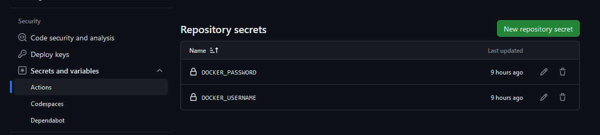
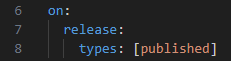
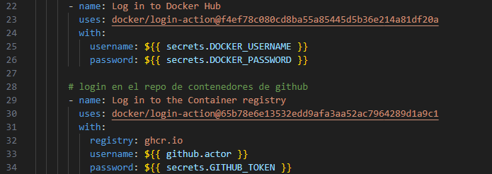
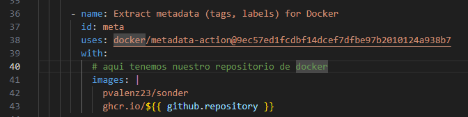
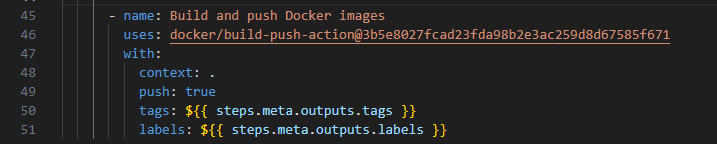
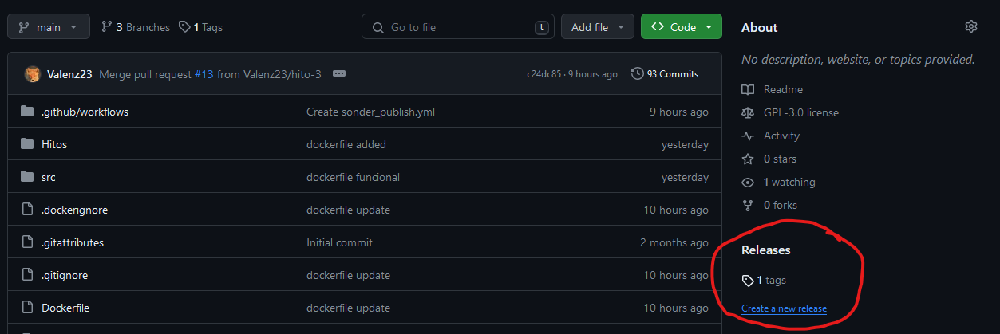
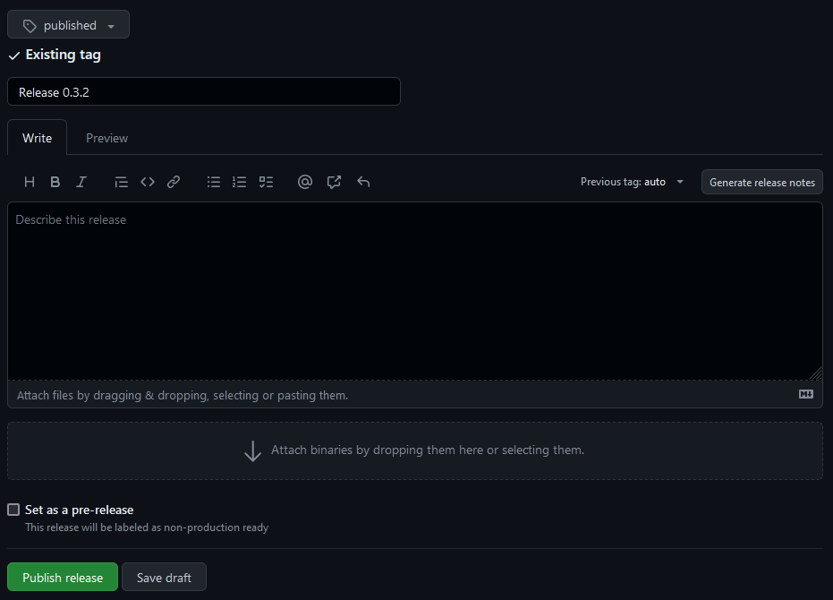

# Publicar en Docker Hub y GitHub Packages

En esta sección vamos a usar un sistema de automatización para subir el contenedor a dos repositorios de contenedores cada vez que publique una `"release"`, para ello vamos a servirnos de GitHub Actions que nos presenta un conjunto de herramientas y servicios para realizar este fin.

A través se un fichero `YAML` situado en nuestro repositorio podemos definir las acciones con las que realizar la publicación en ambos repositorios de contenedores. Pero antes necesitamos hacer unas gestiones para poder identificarnos de manera correcta en **Docker Hub**.

## Guardar usuario y contraseña de Docker Hub en nuestro repositorio

Necesitamos guardar dos `"secretos"` en nuestro repositorio, estos serán nuestro usuario y contraseña de **Docker Hub**. Para ello nos debemos dirigir a nuestro repositorio y navegamos hasta de esta manera: 

`Setting --> Secrets and variables --> Actions --> Repository secrets`

Debemos guardar las variables `DOCKER_USERNAME`y `DOCKER_PASSWORD`, y con esto ya podemos continuar.

## Fichero YAML

Nuestro [documento yaml](../../.github/workflows/sonder_publish.yml)  lo debemos situar dentro de la carpeta `.github\workflows`. Vamos a explicar algunas secciones de el:

1. Aquí se indica que se active cada vez que se realiza una `"release"`.

2. Usamos nuestros `"secretos"` para no exponer de forma pública nuestro usuario y contraseña de los repositorios.

3. Elegimos nuestro repositorio en **Docker Hub**.

4. Y por último, construimos la imagen.

## Realizando una release

Para realizar una `"release"` debemos situarnos en la columna derecha de nuestro directorio raiz de GitHub.

Si pulsamos sobre lo que esta resaltado en rojo en la figura anterior llegamos a la figura siguiente.

Donde solo tenemos rellenar los formularios y pulsar sobre el botón verde para publicarla. Y una vez lo hayamos hecho, solo tendremos que comprobar si se ha publicado.

[Volver](README.md)