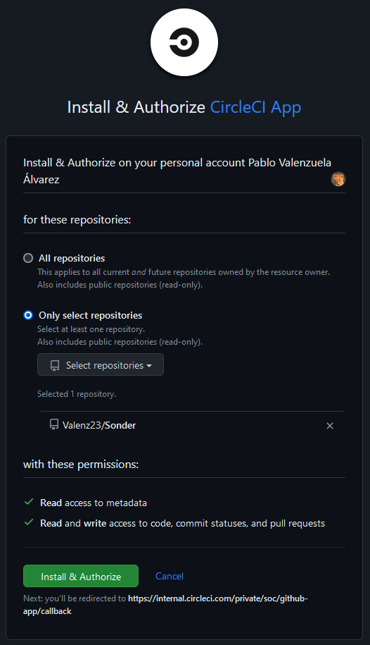
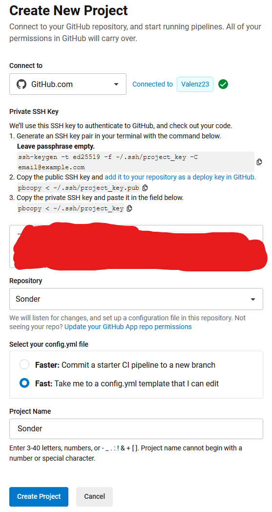
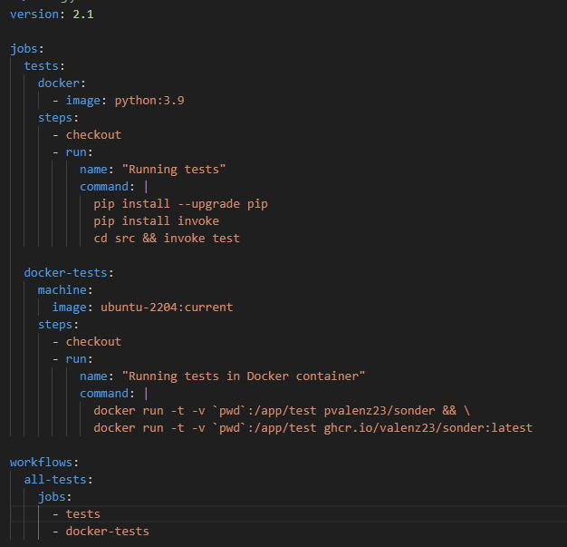
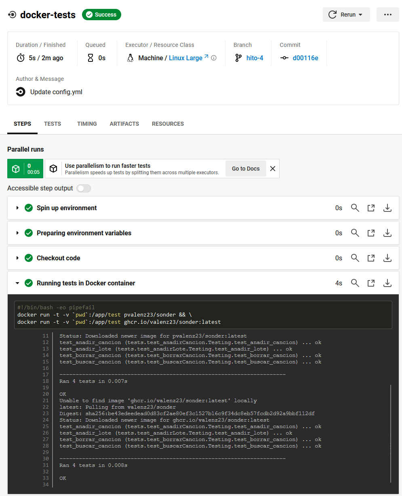

# Configuración de CircleCI

El sistema alternativo de integración continua que vamos a usar es **CircleCI**, que es parecido a **GitHub Actions** en su formato. Esta plataforma permite la integración de aplicaciones ampliamente usadas como *AWS*, *Slack*, *Atlassian*, y cuenta con certificaciones de seguridad, además de ofrecer opciones de alojamiento en la nube.

No es una opción totalmente gratuita, el plan gratuito nos ofrece un total de 6000 minutos de compilación al mes. Dado el carácter de este proyecto, y al ser la plataforma alternativa, dudo que se superen esas cifras.

A continuación comenzaremos a configurar el sistema para la integración continua en esta plataforma.

## Configuración inicial

Una vez nos registremos en la web oficial, podemos conectar nuestro repositorio de github siguiendo las instrucciones abajo mostradas, que son bastante sencillas.

Para que funcione tenemos que generar unas nuevas claves públicas y copiarlas en el lugar que nos indican los pasos 2 y 3 de la siguiente figura.

## Fichero config.yml

Una vez terminada la configuración inicial, podemos crear el archivo de configuración del flujo de trabajo. Este fichero deberá ser nombrado como *config.yml* y tiene que estar ubicado en la carpeta ``.circleci`` en la raiz del proyecto.

El fichero (mostrado en la siguiente ficura), tiene definidos dos flujos de trabajo que se ejecutarán cada vez que se haga un **push**. En este fichero podemos definir tantos tests como queramos mediante la etiqueta ``jobs``, sin olvidar incluirlos en la ejecución final que se hará en la etiqueta ``workflows``.

## Comprobación de los test

Tras realizar un **push**, podemos comprobar el resultado de los tests hechos en el siguiente [enlace](https://app.circleci.com/pipelines/circleci/RbSHdQaX63s4AwV2C5Akhp).

Seleccionando el test correspondiente al último **push** que hemos hecho podemos observar más detalles, como la duración o el código generado de los propios tests (ver siguientes figuras).

[Volver](README.md)
