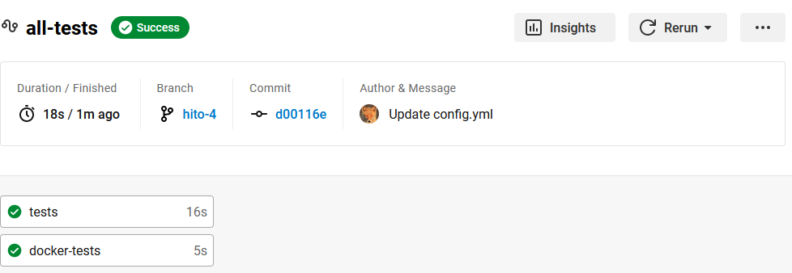

# Configuración de CircleCI

El sistema alternativo de integración continua que vamos a usar es **CircleCI**, que es parecido a **GitHub Actions** en su formato. Esta plataforma permite la integración de aplicaciones ampliamente usadas como *AWS*, *Slack*, *Atlassian*, y cuenta con certificaciones de seguridad, además de ofrecer opciones de alojamiento en la nube.

No es una opción totalmente gratuita, el plan gratuito nos ofrece un total de 6000 minutos de compilación al mes. Dado el carácter de este proyecto, y al ser la plataforma alternativa, dudo que se superen esas cifras.

A continuación comenzaremos a configurar el sistema para la integración continua en esta plataforma.

## Configuración inicial

Una vez nos registremos en la web oficial, podemos conectar nuestro repositorio de github siguiendo unas instrucciones bastante sencillas.

Para que funcione tenemos que generar unas nuevas claves públicas y copiarlas donde nos dicen las instrucciones (ver siguientes fotos).

## Fichero

[dashboard](https://app.circleci.com/pipelines/circleci/RbSHdQaX63s4AwV2C5Akhp/)

[Volver](README.md)
