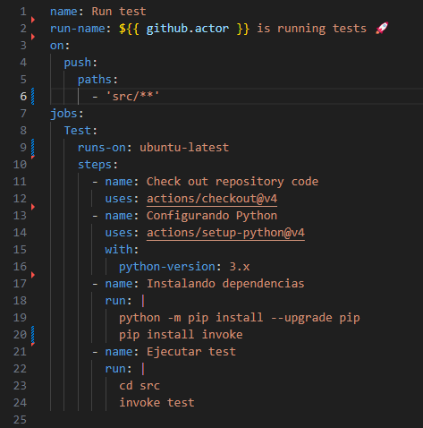
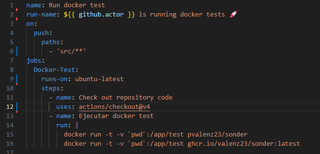
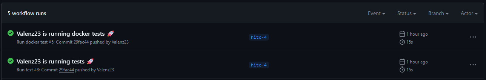
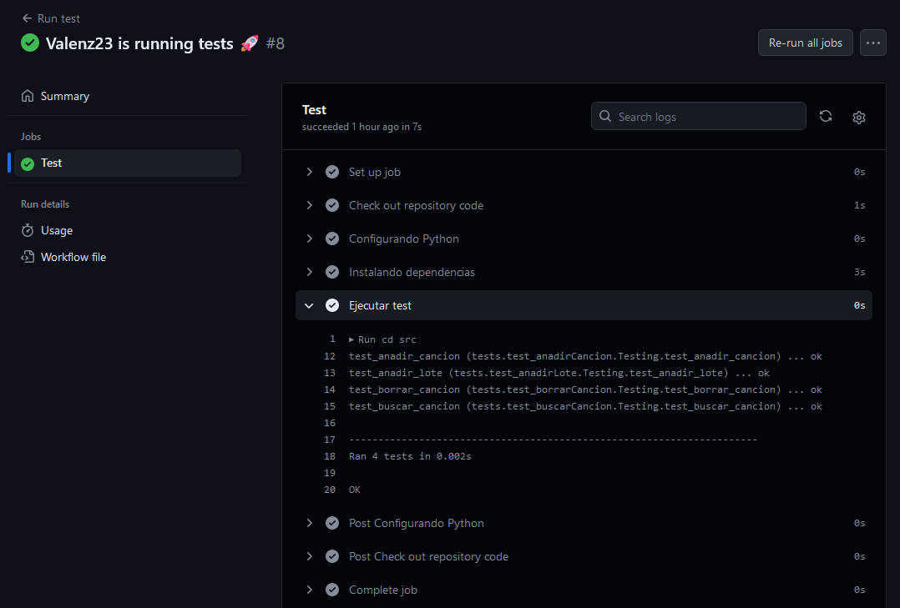
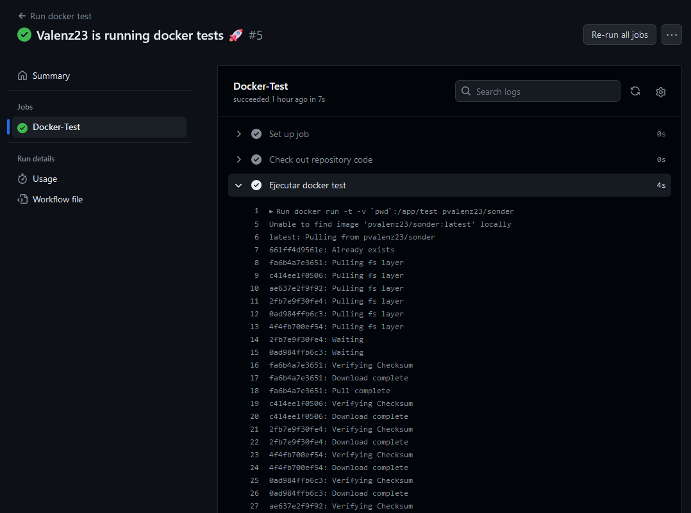
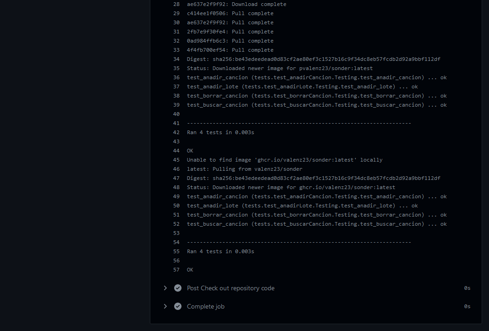

# Configuración de GitHub Actions

Vamos a seguir usando **GitHub Actions** ya que lo usabamos para automatizar el proceso de creación y subida de contenedores a los repositorios indicados en el hito anterior (**Docker Hub** y **GitHub Packages**).

Tenemos que crear dos ficheros más para automatizar la ejecución de los test ([run_test.yml](../../.github/workflows/run_test.yml)) y la prueba de los contenedores ([run_test_docker](../../.github/workflows/run_test_docker.yml)), y ubicarlos en la misma dirección (`.github/workflows`) para que se ejecuten como flujos de trabajos tal y como lo indica la [documentación](https://docs.github.com/en/actions/quickstart) de GitHub Actions.

## Automatizando los test

Empezamos con el primer fichero ([run_test.yml](../../.github/workflows/run_test.yml)).

Esta acción se ejecutará cada vez que hagamos **push**, pero manteniendo una restricción. En la linea 5 me aseguro que solo se ejecute cuando se haga una actualización del código ubicado en la carpeta `src`. Esta carpeta contiene todas las clases, test y demás ficheros importantes para el proyecto.

Esta restricción es relevante porque la mayoría de veces que se hace **push** en este proyecto es para aportar más documentación, y no es interesante que se este ejecutando esta acción todo el rato si no hay cambios en el código.

Por último, comentar que esta acción es la encargada de realizar los test que llevamos realizando desde el hito 2.

## Automatizando los test de contenedores

Seguimos con el segundo fichero ([run_test_docker](../../.github/workflows/run_test_docker.yml)).

Esta acción mantiene las características y restricciones de la anterior. Al final acaba realizando el comando: ``docker run -t -v `pwd`:/app/test repositorio/contenedor``, que descarga y ejecuta los contenedores.

## Comprobamos las acciones

Una vez hayamos realizado un **push** cambiando algo del código , si nos dirigimos a la sección [Actions](https://github.com/Valenz23/Sonder/actions) de nuestro repositorio, deberiamos tener dos nuevas entradas tal y como se muestra en la imagen siguiente.

Como podemos observar, ambas han sido validadas correctamente. Pulsando sobre ellas podemos ver más detalles de su ejecución.

[Volver](README.md)
