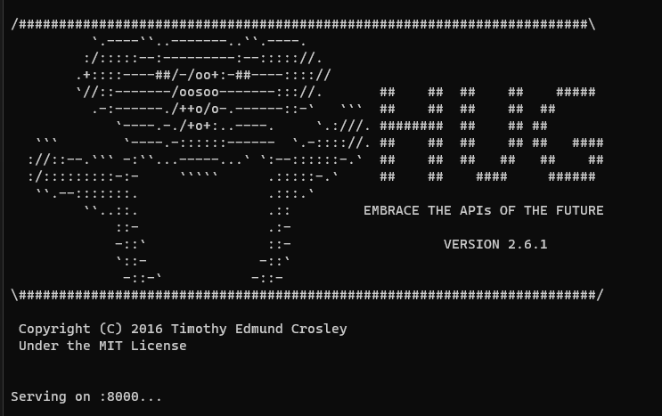

# Framework para el microservicio

Elegir un framework para desarrollar un microservicio depende en gran medida de tus necesidades específicas. La siguente lista muestra diferentes frameworks que podemos usar para nuestro proyecto.

## Lista de frameworks

- **[FastAPI](https://fastapi.tiangolo.com/)**: Es un framework web utilizado para construir  APIs con Python 3.8+. Destaca por su alto rendimiento, velocidad de desarrollo y reducción de errores. Además ofrece facilidad de uso, minimiza la duplicación de código y cumple con los estándares de OpenAI y JSON Schema.
- **[Flask](https://flask.palletsprojects.com/en/3.0.x/)**: Es un "micro" framework desarrollado en Python y concebido para facilitar el desarrollo de aplicaciones web bajo el patrón MVC. Cuenta con un depurador y soporte integrado para realizar pruebas unitarioas. Flask es *open source* y esta amparado  bajo una licencia BSD.
- **[Django REST framework](https://www.django-rest-framework.org/)**: Es una herramienta potente y flexible para construir APIs web. Inlcuye una interfaz de usuario, politicas de autenticación y capacidad de personalización completa. Además cuenta con una extensa documentación y sólido respaldo de la comunidad. Actualmente es usado por empresas como: *Mozilla, Red Hat, Heroku* y *Eventbrite*.

- **[Hug](https://hugapi.github.io/hug/)**: Tiene como objetivo desarrollar APIs impulsadas por Python de la forma más sencilla posible. Como resultado este framework prioriza la concisión, rapidez y la facilidad para realizar pruebas. Hug, busca ser la base para la siguiente generación de APIs.

## Elección del framework

Como muestra la foto anterior, el framework elegido para realizar nuestra API es **hug**. Las razones de su elecciónn son las siguiente:
- Como decía en el punto anterior, su **simplicidad** y **facilidad** de uso ayuda a desarrollar rápido y sin apenas complicaciones.
- Tiene un buen **rendmiento** y ofrece **flexibilidad** en el manejo de datos y formatos, lo que es útil para mostrar información en los test de la API.

### Instalación y uso

Hay que instalar la librería de **hug**, para ello debemos dirigirnos a nuestra consola y escribir: 

``pip install hug``

Una vez instalado, nos dirigimos al directorio de nuestra API desde consola (suponiendo que ya la tenemos desarrollada) y escribimos:

``hug -f miAPI.py``

Por defecto, hug usa el puerto 8000 para la API, aunque es este es personalizable.

[Volver](README.md)
