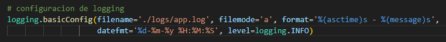
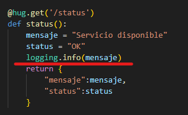
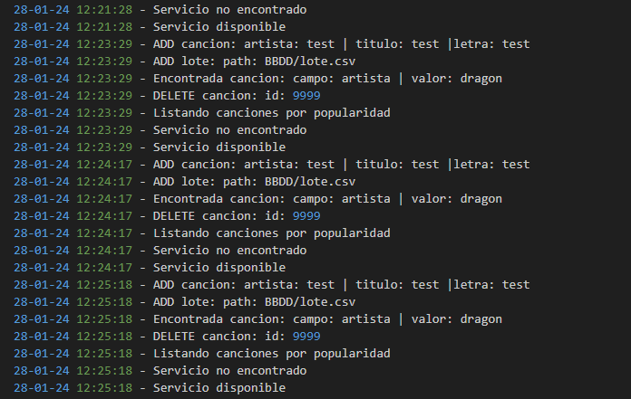

# Uso de logs

Para generar logs se ha usado la librería **logging**. Esta librería esta incluida en Python y se puede usar con el framework **hug** para generar los registros de nuestra API muy fácilmente.

Para obtener más información de esta librería podemos acceder a su [documentación](https://docs.python.org/3/library/logging.html).

## Configuración y resultados

Para configurar **logging** basta con escribir la siguiente línea en nuestra API.

La orden ``logging.info(mensaje)`` manda al archivo de logs antes configurado el mensaje correspondiente a la funcionalidad ejecutada.

Una vez realizadas varias llamadas a la API, el fichero de logs debería parecerse a el de la siguiente imagen.

[Volver](README.md)
