# Test de la API

Para las pruebas sobre las funcionalidades de la API se uso [POSTMAN](https://www.postman.com/). Esta es una aplicación que nos posibilita testear "HTTP resquest" a través de una interfaz gráfica, entre las cuales están los métdos **GET**, **PUT** y **DELETE**, que utilizamos en nuestra API.

## Lista de funcionalidades

### **Status**: Comprueba que el servicio está activo.

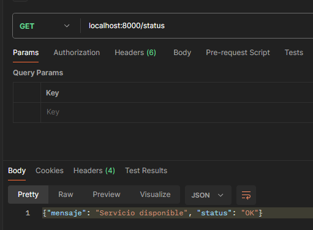

### **Buscar**: Busca una canción.

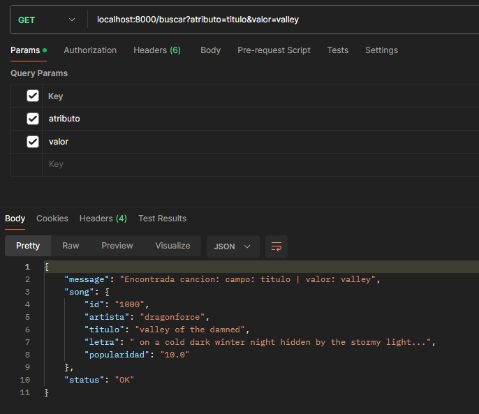

### **Add**: Añade una canción.

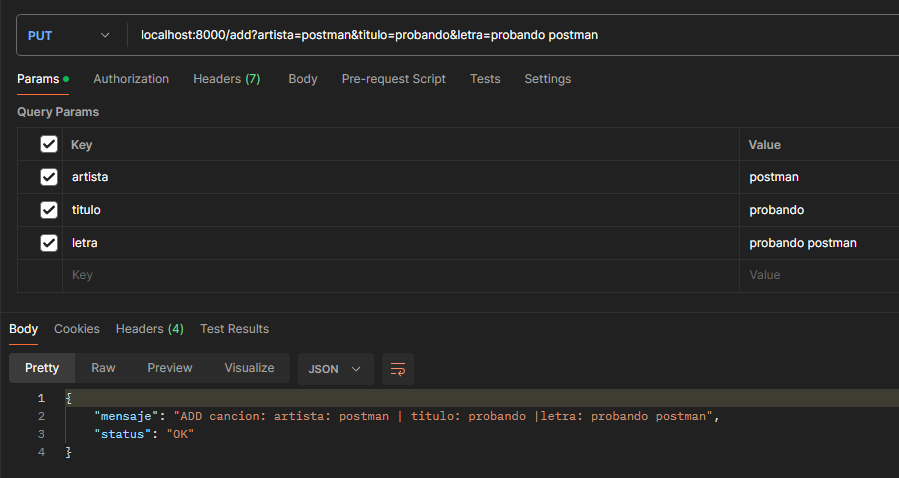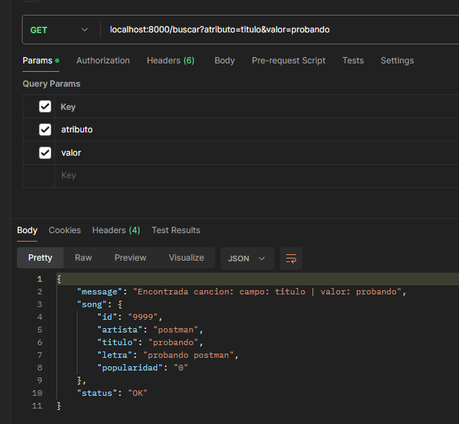

### **Del**: Elimina una canción.

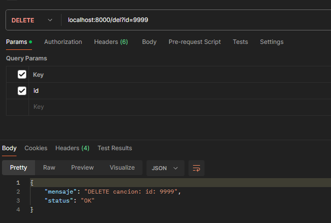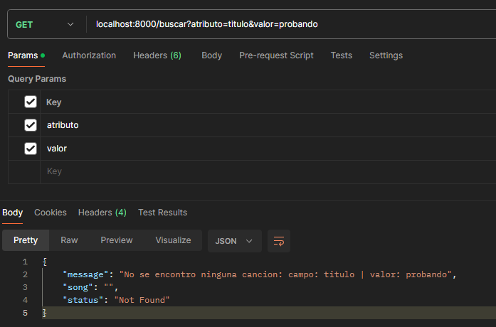

### **Lote**: Añade muchas canciones de golpe.

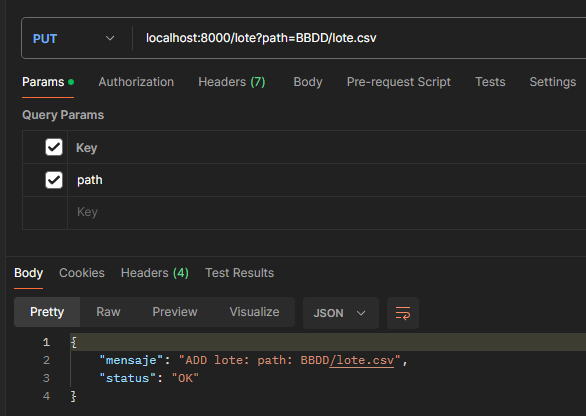

### **Lista**: Lista canciones por popularidad.

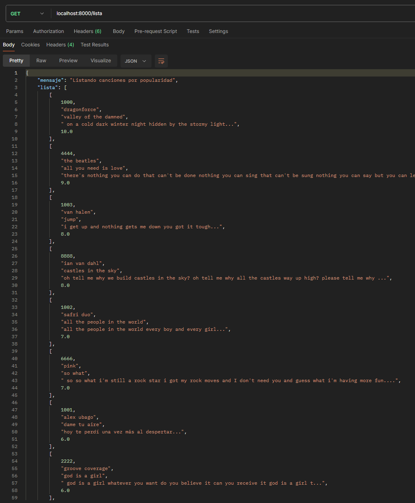

### **Mod**: Modifica la letra de una canción.

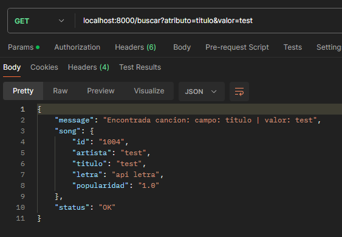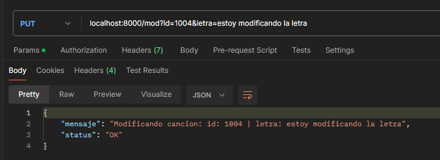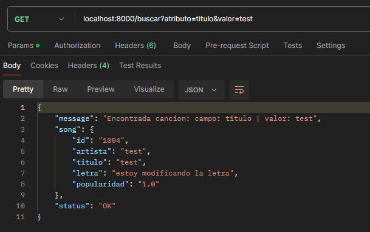

## Logs

Si comprobamos los logs, podemos ver como se guardan estas acciones que hemos realizado en la API.

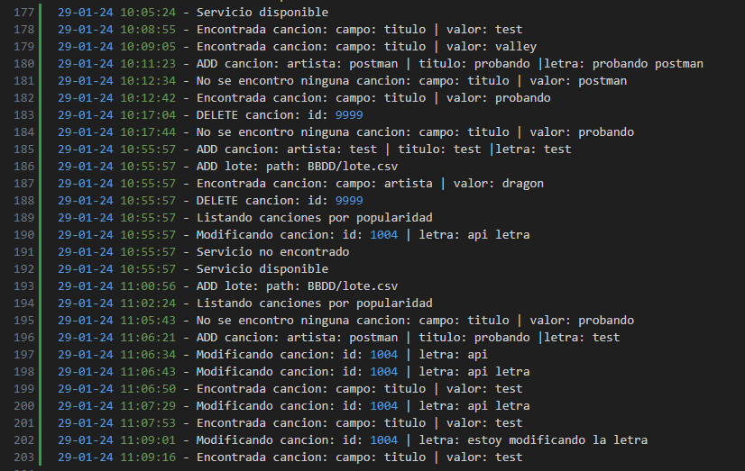

[Volver](README.md)
