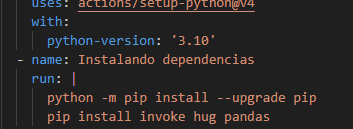
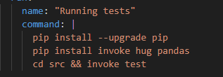
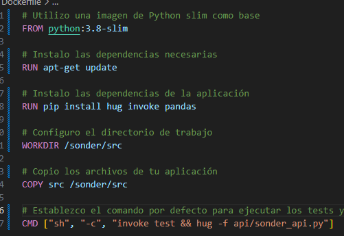

# Errores corregidos

En esta sección extra comentaré dos problemas que se han solucionado debido a la agregación de varias librerías (hug, ...)

## Integración continua

Se comprobó que, al actualizar el repositorio, los tests hechos para el hito 4 no se pasaban.

Por lo tanto se tuvieron que incluir las nuevas librerías en ambas plataformas.

* Test de [github](../../.github/workflows/run_test.yml):

    

* Test de [circleCI](../../.circleci/config.yml):

    

## Dockerfile

Se ha cambiado el archivo [*Dockerfile*](../../Dockerfile), ahora usa otro contenedor base (python:3.8-slim) que hace la ejecución del contenedor más simple y concisa. La única pega es que ahora el contenedor pesa el triple que el original, pero era necesario si se quería usar el framework **hug**.

[Volver](README.md)
