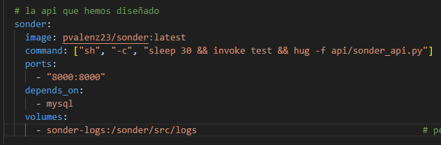
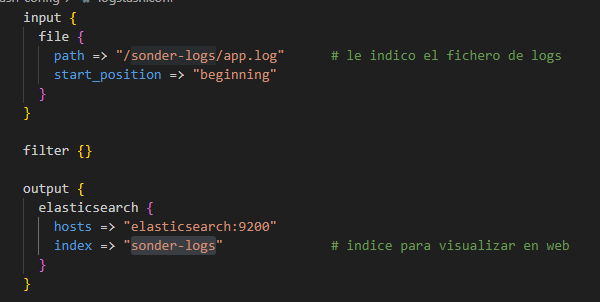

# Composición del servicio

En total, mi el fichero **[compose.yaml](../../compose.yaml)** consta de cinco contenedores.

A continuación vamos a describir la estructura del fichero, parándonos en cada uno.

## Base de datos

La base de datos esta construida sobre una imagen **MySQL**.

Usa el volumen *mysql-data* para guardar los datos.
Para la configuración usa otros dos volumenes que no son compartidos entre los demás servicios:
1. **[init.sql](../../src/BBDD/init.sql)**: Creación y configuración inicial del BBDD.

    

2. **[cancionese.csv](../../src/BBDD/canciones2.csv)**: Datos iniciales de la BBDD.

    

## API

La API corresponde a nuestro proyecto **Sonder**.

Esta construida sobre el **[Dockerfile](../../Dockerfile)** definido en el hito anterior. Y usa el volumen en el que vuelca los logs.

## Logs

Como se ha comentado anteriormente en este hito, para visualizar los logs se usará **ELK**, un paquete que contiene tres contenedores (*elasticsearch*, *logstash* y *kibana*).

Se utilizará **kibana** para visualizar los logs, mientras que con **logstash** configuraremos el fichero de su lectura.

El servicio **logstash** usa dos volúmenes:

1. El archivo de configuración **[logstash.conf](../../logstash-config/logstash.conf)**: Donde se define el fichero de logs y el índice que se usará en la visualización.

    

2. Volumen correspondiente a los logs.

## Volúmenes

Por último, el fichero comparte los siguientes dos volúmenes entre los servicios.

[Volver](README.md)