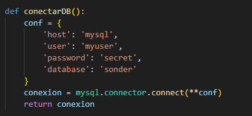
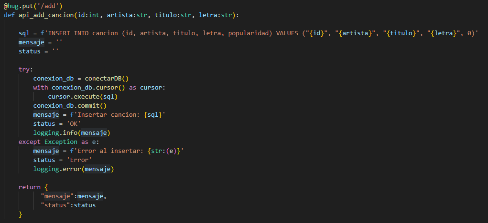

# Cambios en la API

El fichero de llamadas a la **[API](../../src/api/sonder_api.py)**, ha sufrido un gran cambio respecto al hito 5. Se ha tenido que adaptar todo el código para que se conecte a la base de datos que vamos a usar, y todas las llamadas son consultas sobre esa base de datos.

## Llamadas a la API

* **Conexión a la base de datos**:

    

* **Buscar**:

    

* **Insertar**:

    

* **Borrar**:

    

* **Insertar lote**:

    

* **Listar por popularidad**:

    

* **Modificar letra**:

    

## Test y Logs

Los **[test](../../src/api/test_sonder_api.py)** sobre la API en este hito no han variado, y el resultado de los **logs** son los que se pueden ver en la siguiente imagen:

[Volver](README.md)