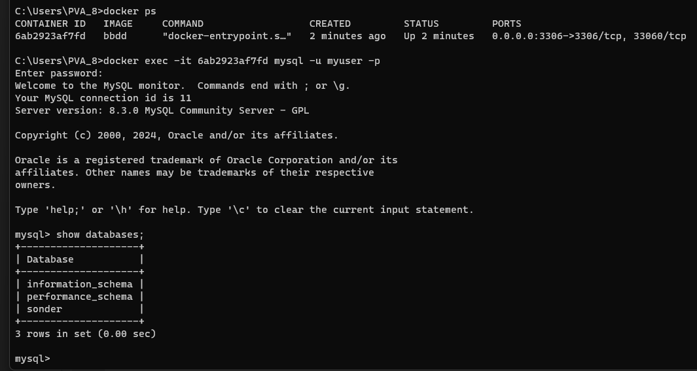

# Configuración de MySQL

## Prueba del Dockerfile

Para probar el funcionamiento del contenedor de **MySQL**, he realizado el siguiente *Dockerfile*:


Este fichero usa la última versión de mysql y copia dos ficheros, uno con el script de creación de las tablas y otro con el contenido inicial de estas.

El primer fichero (foto a continuación), crea la tabla "*cancion*" y la rellena con los datos contenidos en el fichero CSV mostrado en la línea 12.


El fichero CSV contiene los mismos datos vistos en anteriores hitos.


## Ejecución y test del contenedor

Creamos la imagen: ```docker build -t bbdd . ```

Y el contenedor: ```docker run -p 3306:3306 bbdd```

Y probamos si ha funcionado:



Como se puede ver en las dos imágenes anteriores, la base de datos se ha creado correctamente y contiene los datos del fichero CSV.

Este estudio realizado nos facilitará el proceso más tarde de crear el fichero de orquestación de contenedores.

[Volver](README.md)