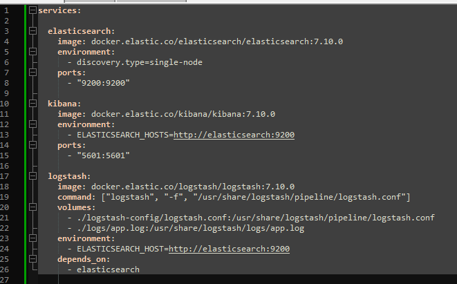
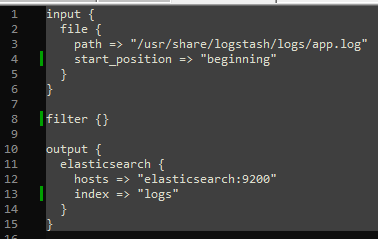
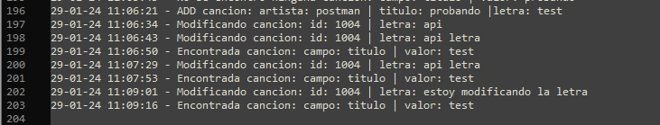
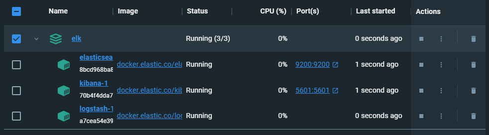
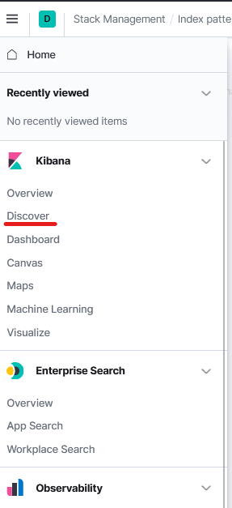
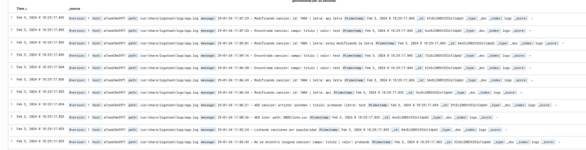

# Configuración de ELK

## Prueba del compose

Para probar el funcionamiento de ELK necesitamos los tres contenedores correspondientes, por lo que tenemos que montar el fichero ``compose.yaml`` con estos servicios.

En el fichero anterior, usamos los servicios de elasticsearch y kibana, con sus puertos correpondiente. En el servicio de logstash hay un poco más de detalle, se usan dos volúmenes para copiar archivos en "local" al cotenedor.

Los archivos contienen:
1. **Un archivo de configuración**: 

2. **El fichero de logs**: Con el mismo formato visto en hitos anteriores.

## Ejecución y test

Ejecutamos la orden ``docker compose up``.

Una vez tengamos los servicios activos, nos dirigimos a nuestro navegador a la dirección ``localhost:5601``, correspondiente a **Kibana**.

Seguido, nos dirigimos a la ``Management > Index Patterns`` , y añadimos el índice que hemos nombrado en el fichero de configuración de **Logstash** (en este caso, logs).

Ahora nos dirigimos al menu lateral izquierdo y seleccionamos ``Discover`` como se muestra en la figura siguiente:

Y como se puede observar en la siguiente imagen, se han cargado los **logs** del fichero y ya son accesibles vía web.

Como en el apartado anterior, este estudio realizado hay que aplicarlo ahora en nuestra API.

[Volver](README.md)