## Prueba de la API y visualización de logs

Para finalizar el hito, vamos a realizar una bateria de pruebas sobre la API y mostraremos la salida que obtenemos finalizando con una visualización de los logs.

**NOTA**: Para poder ver los logs la primera vez que nos dirijamos a la dirección ``localhost:5601``, tenemos que seguir los mismos pasos que los expuestos en este [documento](confELK.md#ejecución-y-test) de este hito. Esto sólo es necesario hacerlo la primera vez.

## Batería de test

La siguiente batería de test se ha hecho siguiendo el mismo orden de la lista, entre la hora **12:00** y **12:06** del 4 de Febrero de 2024.

1. **Búsqueda del artista test**: no hay datos.

    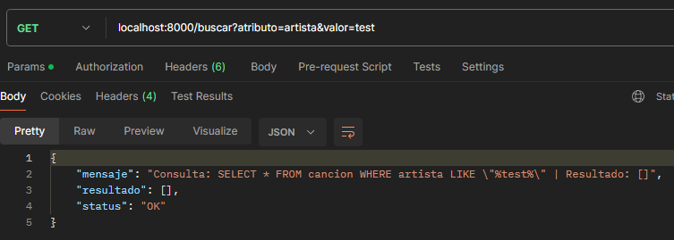

2. **Inserción del artista test**.

    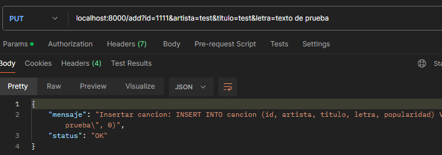

3. **Búsqueda otra vez del artista: test**: aparecen los datos que acabamos de insertar.

    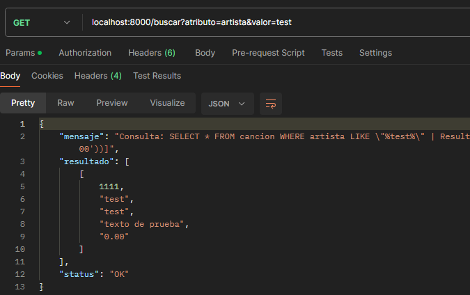

4. **Modificación de la letra de la canción con id=1111**.
    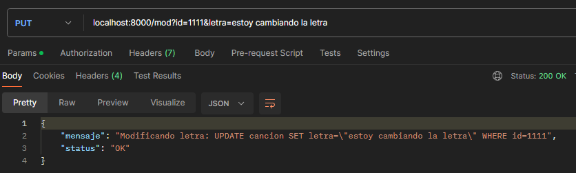

5. **Búsqueda del artista test**: comprobación de que la letra se ha modificado.

    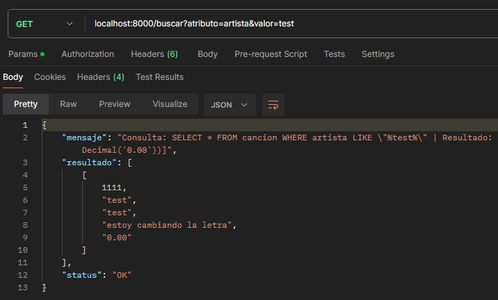

6. **Borrado de la canción con id=1111**.

    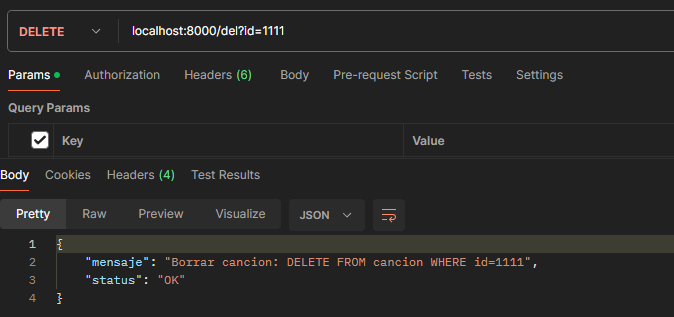

7. **Búsqueda del artista test**: comprobación del borrado de la canción.

    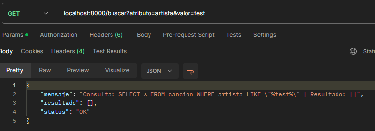

8. **Listado de canciones por popularidad**.

    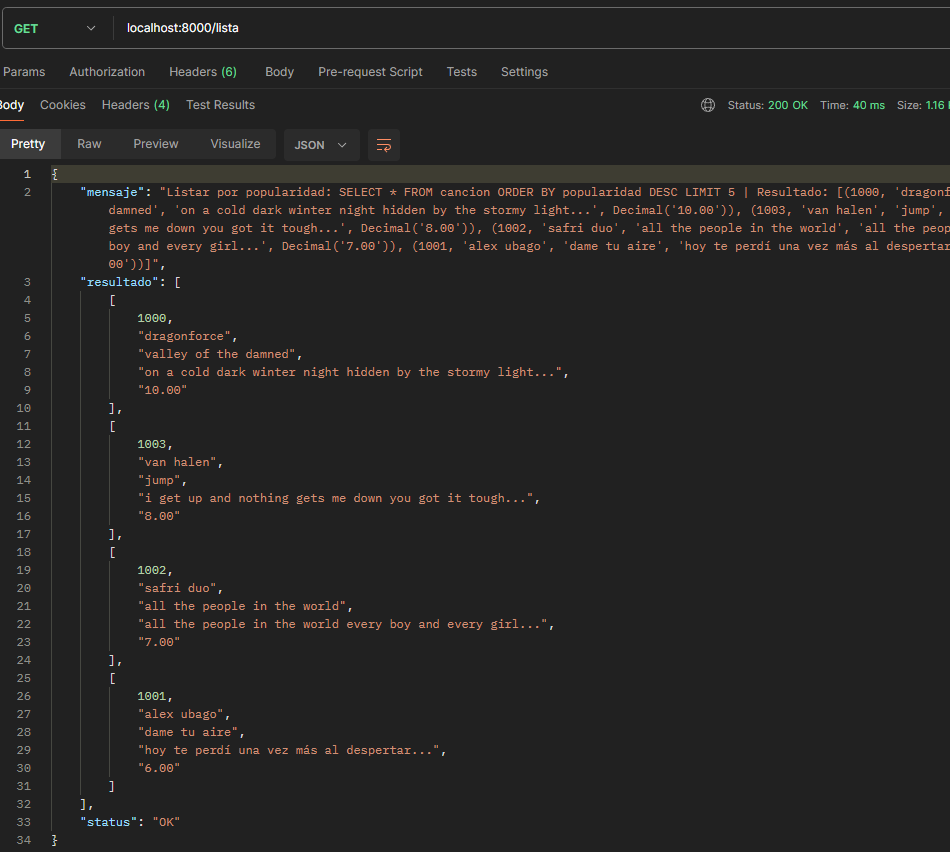

9. **Inserción de lote de canciones**.

    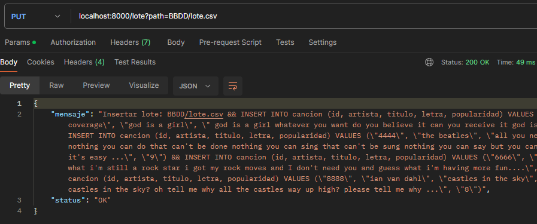

8. **Listado de canciones por popularidad**: comprobamos que las nuevas canciones insertadas aparecen en el listado.

    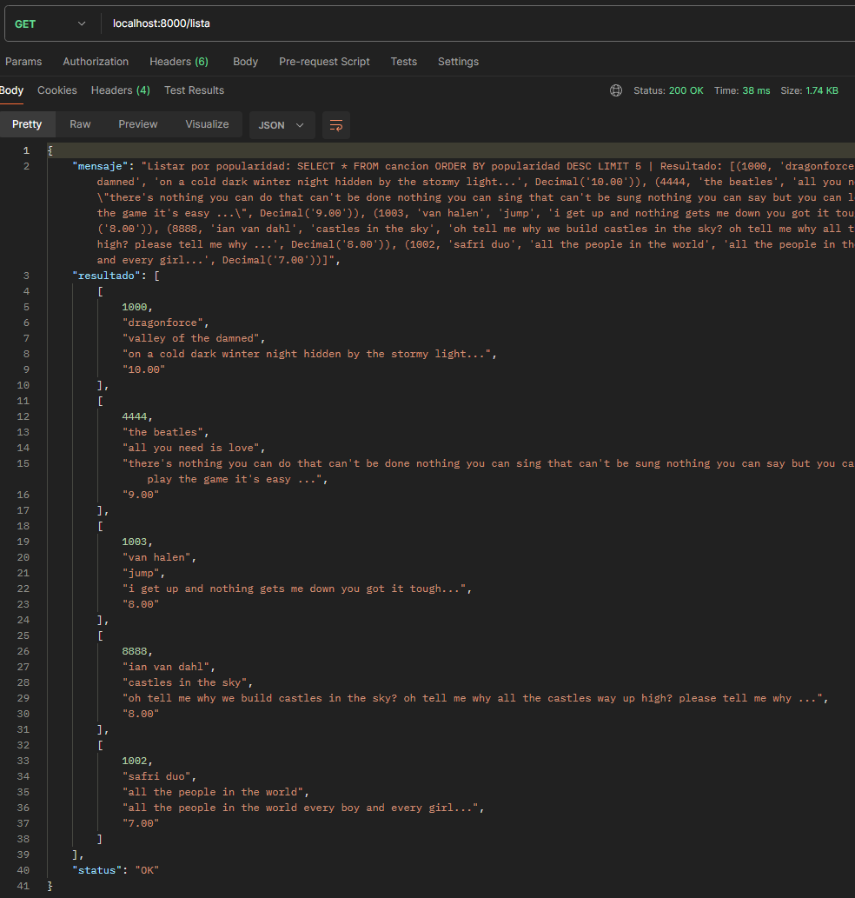

## Visualización de logs

Ahora vamos a comprobar si se actualizan los logs con estas llamadas.

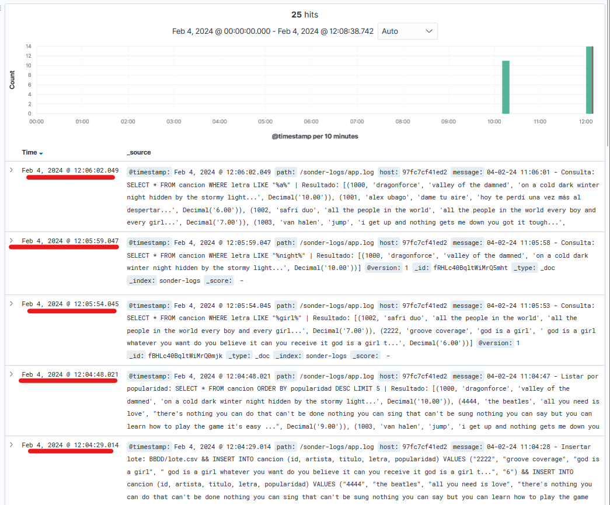

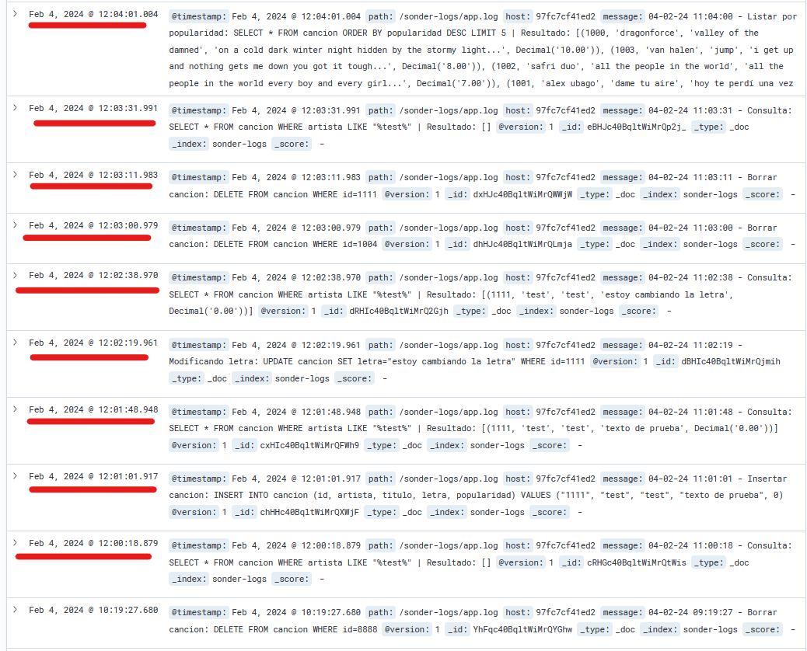

Como se puede ver en las imágenes anteriores, las fechas (señaladas en rojo) coinciden con la hora a la que realizaron las llamadas a la API, es decir, somos capaces de visualizar los logs correctamente.

[Volver](README.md)