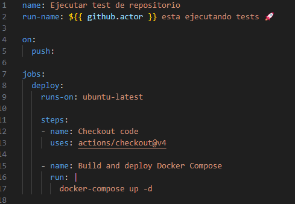
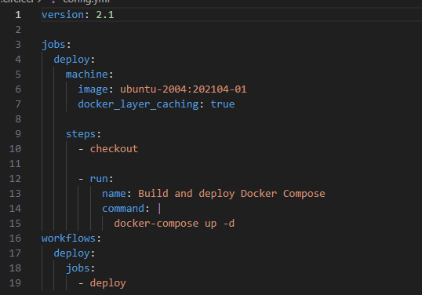
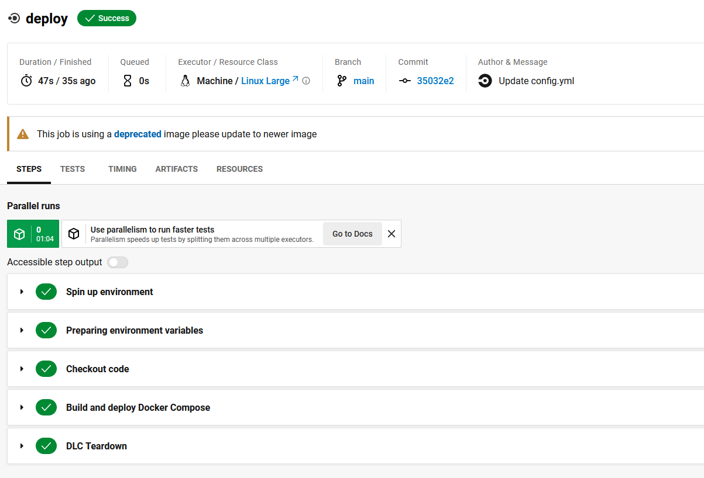

## Modificación de test CI

Respecto a la integración continua, se han modificado los test para adaptarlos a la ejecución del fichero [compose.yaml](../../compose.yaml).

## GitHub Actions

El [test](../../.github/workflows/run_test.yml) ejecuta el compose.

## circleCI

El [test](../../.circleci/config.yml) ejecuta el compose.

## Resultados de los test

Si nos dirigimos a la sección de acciones del [repositorio](https://github.com/Valenz23/Sonder/actions) podemos seleccionar los últimos test realizados.

Las fotos anteriores muestran la ejecución exitosa del ultimo test realizado.

En el entorno de [circleCI](https://app.circleci.com/pipelines/circleci/RbSHdQaX63s4AwV2C5Akhp) también funcionan los test.

[Volver](README.md)